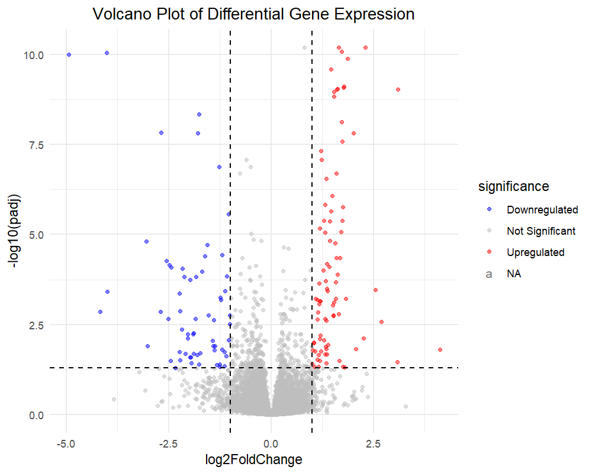
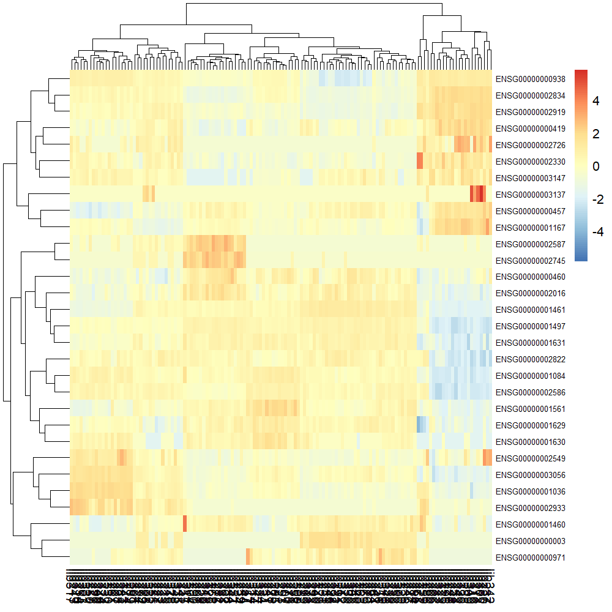

# RNA-seq Differential Expression Analysis

This project performs differential gene expression analysis using RNA-seq count data. The analysis identifies significantly upregulated and downregulated genes between two conditions.

## Tools & Packages
- R
- DESeq2
- ggplot2
- pheatmap

## Workflow
1. Data loading and preprocessing
2. Differential expression analysis using DESeq2
3. Visualization:
   - Volcano plot
   - Heatmap of top genes

## Results

### Volcano Plot

### Heatmap

## Key Findings
- Identified significantly differentially expressed genes (adjusted p-value < 0.05)
- Clear separation between upregulated and downregulated genes
- Clustering of top genes shows distinct expression patterns

## Author
Niranjan P B
